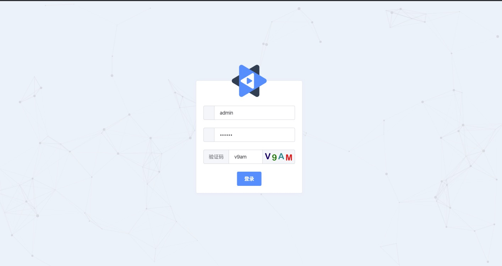
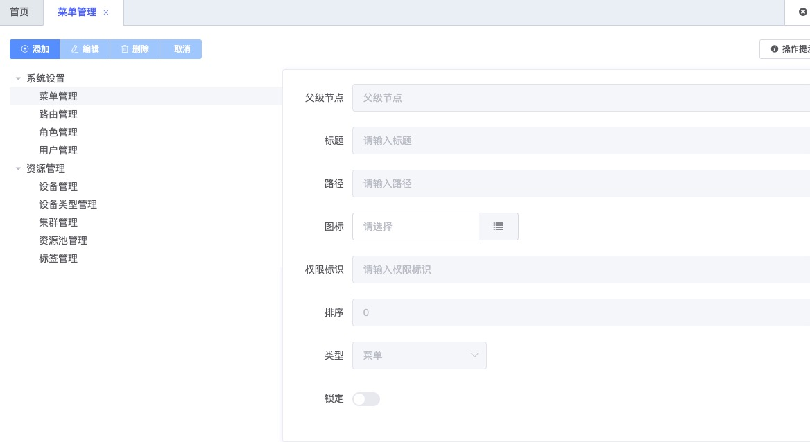
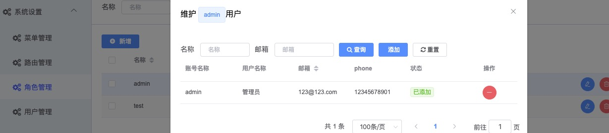

### 运行使用
#### 说明
前端项目借鉴了如下两个项目：
  - [d2-admin](https://github.com/d2-projects/d2-admin)
  - [d2-admin-pm](https://github.com/wjkang/d2-admin-pm.git)

```bash
git clone https://github.com/lwydyby/springboot-cli-web

npm install

npm start
```
需要后端服务的支持
```bash
git clone https://github.com/lwydyby/springboot-cli-server
```
### 功能预览






### 对上述两个项目的修改

1. 在pm基础上为了和springboot后端适配，修改部分权限的逻辑

2. 增加了脚手架工具，可以自动生成前端页面的代码（具体使用后续补到博客里）

### 关联项目

[springboot后端服务](https://github.com/lwydyby/springboot-cli-server)

[vue前端项目](https://github.com/lwydyby/springboot-cli-web)

[项目脚手架](https://github.com/lwydyby/springboot-cli-generator)


<a href="https://github.com/d2-projects/d2-admin" target="_blank"></a>